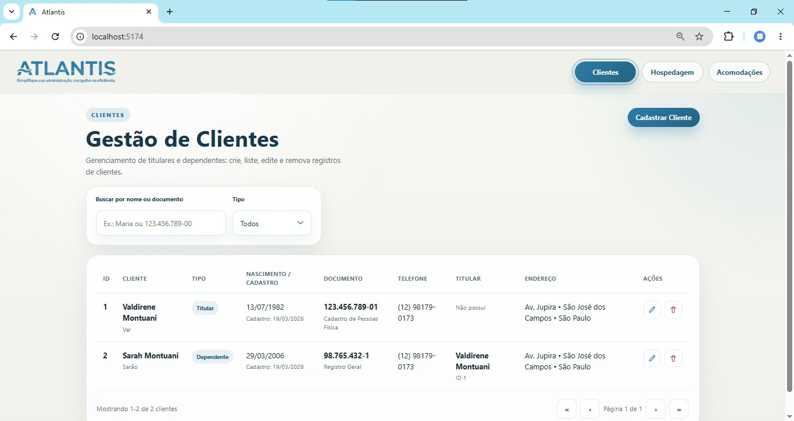
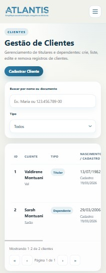
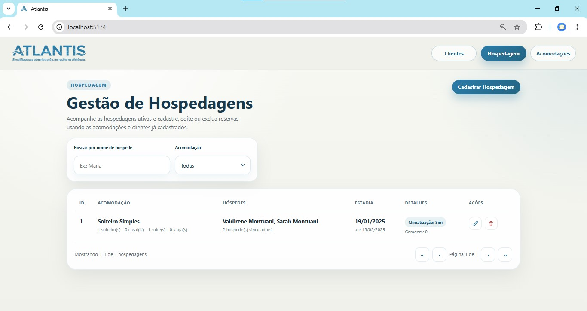
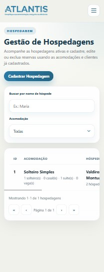
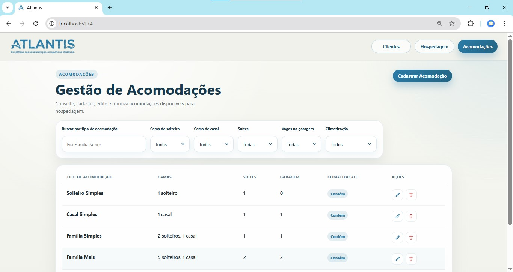
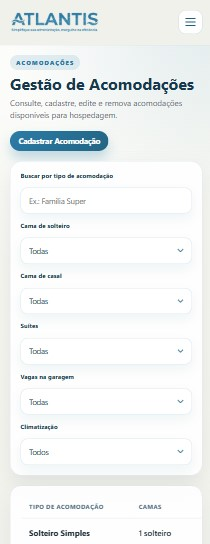



O Atlantis é um sistema de gestão para parques aquáticos, clubes e hotéis. Nesta versão, o projeto atende ao MVP solicitado na atividade com a construção de um frontend completado para toda a estrutura já construida.

## Requisitos para rodar

- Node.js: v24.13.1 (versão testada)
- npm: versão que acompanha o Node v24.13.1

## Como rodar o projeto

### 1) Clonar o repositório

```bash
git clone https://github.com/SarahBatagioti/AV4-TPII.git
```

### 2) Entrar na pasta do projeto

```bash
cd AV4-TPII
```

### 3) Instalar as dependências do backend

```bash
cd backend
npm install
```

### 4) Rodar o backend

```bash
npm run start:api
```

Espere aparecer a mensagem `API Atlantis rodando em http://localhost:3333`.

### 5) Abrir um novo terminal na pasta do projeto

Com o backend ainda rodando no primeiro terminal, abra um segundo terminal e volte para a raiz do repositório:

```bash
cd AV4-TPII
```

### 6) Instalar as dependências do frontend

```bash
cd frontend
npm install
```

### 7) Rodar o frontend

```bash
npm run dev
```

Espere aparecer o endereço local, normalmente `http://localhost:5173/`, e acesse esse link no navegador.

# Demonstração do projeto

### Tela de gerenciamento de clientes
Permite visualizar, cadastrar, editar e remover clientes de forma centralizada. A tela organiza os dados principais de cada hóspede, facilitando o controle de titulares, dependentes e informações cadastrais tanto em desktop quanto em dispositivos móveis.
<div style="display: flex; gap: 10px; height: 350px;">
  
  
</div>

### Tela de gerenciamento de hospedagens
Reúne o controle das hospedagens cadastradas, com recursos para criar, editar e excluir registros. Também permite informar o período da estadia por meio das datas de início e fim, tornando o acompanhamento das reservas mais claro e prático.
<div style="display: flex; gap: 10px; height: 350px;">
  
  
</div>

### Tela de gerenciamento de Acomodações
Apresenta o cadastro e a administração das acomodações disponíveis no sistema. Nessa tela é possível visualizar, editar e excluir acomodações, mantendo atualizado o controle dos espaços oferecidos pelo empreendimento.
<div style="display: flex; gap: 10px; height: 350px;">
  
  
</div>